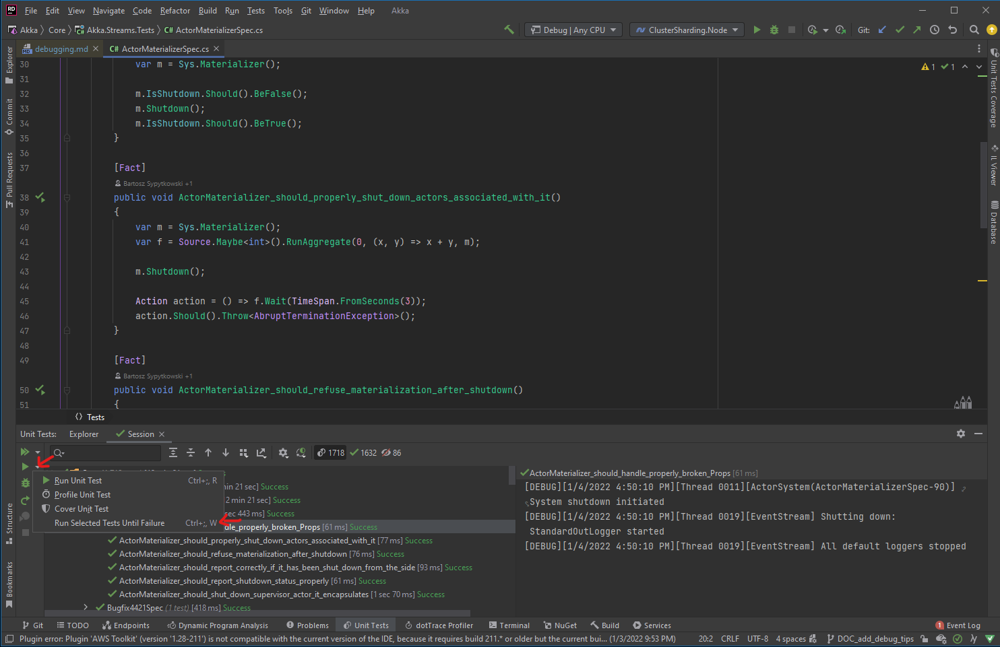

# Debugging Akka.NET

> [!NOTE]
> This article is intended to provide advice to OSS contributors working on Akka.NET itself, not necessarily end-users of the software. End users might still find this advice helpful, however.

## Racy Unit Tests

Akka.NET's test suite is quite large and periodically experiences intermittent "racy" failures as a result of various issues. This is a problem for the project as a whole because it causes us not to carefully investigate periodic and intermittent test failures as thoroughly as we should.

You can view [the test flip rate report for Akka.NET on Azure DevOps here](https://dev.azure.com/dotnet/Akka.NET/_test/analytics?definitionId=84&contextType=build).

What are some common reasons that test flip? How can we debug or fix them?

### Expecting Messages in Fixed Orders

One common reason for tests to experience high flip rates is that they expect events to happen in a fixed order, whereas due to arbitrary scheduling that's not always the case.

For example:

[!code-csharp[PoorOrderingSpec](../../../src/core/Akka.Docs.Tests/Debugging/RacySpecs.cs?name=PoorMsgOrdering)]

The fundamental mistake this spec author made was using simple ordering assumptions: messages are processed in the order in which they're called. This is true *per actor*, not true for *all actors* in the given process. Once we split the traffic between more than one actor's mailbox all of our ordering assumptions go out the window.

How do we fix this? Two possible ways.

[!code-csharp[FixedMsgOrdering](../../../src/core/Akka.Docs.Tests/Debugging/RacySpecs.cs?name=FixedMsgOrdering)]

The simplest way in this case is to just change the assertion to an `ExpectMsgAllOf` call, which expects an array of messages back *but doesn't care about the order in which they arrive*. This approach may not work in all cases, so the second approach we recommend to fixing these types of buggy tests will usually do the trick.

[!code-csharp[SplitMsgOrdering](../../../src/core/Akka.Docs.Tests/Debugging/RacySpecs.cs?name=SplitMsgOrdering)]

In this approach we split the assertions up across multiple `TestProbe` instances - that way we're not coupling each input activity to the same output mailbox. This is a more generalized approach for solving these ordering problems.

### Not Accounting for System Message Processing Order

An important caveat when working with Akka.NET actors: system messages always get processed ahead of user-defined messages. `Context.Watch` or `Context.Stop` are examples of methods frequently called from user code which produce system messages.

Thus, we can get into trouble if we aren't careful about how we write our tests.

An example of a buggy test:

[!code-csharp[BuggySysMsgSpec](../../../src/core/Akka.Docs.Tests/Debugging/RacySpecs.cs?name=PoorSysMsgOrdering)]

Because system messages jump the line there is no guarantee that this actor will ever successfully process their system message - it depends on the whims on the `ThreadPool` and how long it takes this actor to get activated, hence why it's racy.

There are various ways to rewrite this test to function correctly without any raciness, but the easiest way to do this is to re-arrange the assertions:

[!code-csharp[CorrectSysMsgOrdering](../../../src/core/Akka.Docs.Tests/Debugging/RacySpecs.cs?name=CorrectSysMsgOrdering)]

In the case of `Context.Watch` and `ExpectTerminated`, there's a second way we can rewrite this test which doesn't require us to alter the fundamental structure of the original buggy test:

[!code-csharp[PoisonPillSysMsgOrdering](../../../src/core/Akka.Docs.Tests/Debugging/RacySpecs.cs?name=PoisonPillSysMsgOrdering)]

The bottom line in this case is that specs can be racy because system messages don't follow the ordering guarantees of the other 99.99999% of user messages. This particular issue is most likely to occur when you're writing specs that look for `Terminated` messages or ones that test supervision strategies, both of which necessitate system messages behind the scenes.

### Timed Assertions

Time-delimited assertions are the biggest source of racy unit tests generally, not just inside the Akka.NET project. These types of issues tend to come up most often inside our Akka.Streams.Tests project with tests that look like this:

[!code-csharp[TooTightTimingSpec](../../../src/core/Akka.Docs.Tests/Debugging/RacySpecs.cs?name=TooTightTimingSpec)]

This spec is a real test from Akka.Streams.Tests at the time this document was written. It designed to test the backpressure mechanics of the `GroupedWithin` stage, hence the usage of the `Throttle` flow. Unfortunately this stage depends on the scheduler running behind the scenes at a fixed interval and sometimes, especially on a busy Azure DevOps agent, that scheduler will not be able to hit its intervals precisely. Thus, this test will fail periodically.

Thus there are a few ways we can fix this spec:

1. Use `await` instead of `Task.Wait` - generally we should be doing this everywhere when possible;
2. Relax the timing constraints either by increasing the wait period or by wrapping the assertion block inside an `AwaitAssert`; or
3. Use the `TestScheduler` and manually advance the clock. That might cause other problems but it takes the non-determinism of the business of the CPU out of the picture.

## Testing For Racy Unit Tests Locally

A racy test under Azure DevOps might run fine locally, and we might need to force run a test until they fail. Here are some techniques you can use to force a test to fail.

### Running Tests Under Very Limited Computing Resources

Azure DevOps virtual machines ran under a very tight computing resource budget. It is sometime necessary
for us to emulate that locally to test to see if our code changes would run under a very limited resource
condition. The easiest way to do this is to leverage the Windows 10 WSL 2 Linux virtual machine feature.

* Install SWL 2 by following these [instructions](https://docs.microsoft.com/en-us/windows/wsl/install)
* Create a `.wslconfig` file in `C:\Users\[User Name]\`
* Copy and paste these configuration.

```ini
[wsl2]
memory=2GB   # Limits VM memory in WSL 2 up to 2GB
processors=2 # Makes the WSL 2 VM use two virtual processors
```

#### Rebooting `wsl` With Updated Settings

Once you've made your changes to `.wslconfig` you'll need to reboot your instance for them to take effect.

You can list all of your `wsl` distributions via `wsl -l` or `wsl --list`:

```shell
Windows Subsystem for Linux Distributions:
Ubuntu (Default)
docker-desktop-data
docker-desktop
```

In this case we need to terminate our default `Ubuntu` `wsl` instance:

```shell
wsl --terminate Ubuntu
```

The next time we try to launch `wsl` our `.wslconfig` settings will be active inside the environment.

### Repeating a Test Until It Fails

If you're using JetBrains Rider, you can use their unit test feature to run a test until it fails.
On the `Unit Tests` tab, click on the drop down arrow right beside the the play button and click on the
`Run Selected Tests Until Failure` option.



Another option is to leverage the Xunit `TheoryAttribute` to run a test multiple time. We provided a
convenience `RepeatAttribute` to do this.

```c#
using Akka.Tests.Shared.Internals;

[Theory]
[Repeat(100)]
public void RepeatedTest(int _)
{
    ...
}
```
