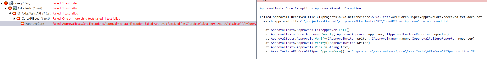
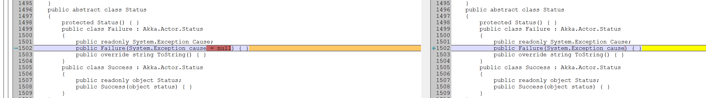
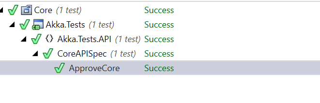
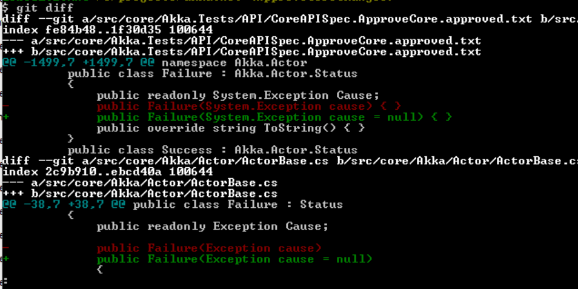

# Making Public API Changes
Akka.NET follows the [semantic versioning methodology](http://semver.org/), and as such the most important convention we have to be mindful of is accurately communicating to our users whether or not Akka.NET is compatible with previous versions of the API.

As such, we have automated procedures designed to ensure that accidental breaking / incompatible changes to the Akka.NET public API can't sail through the pull request process without some human acknowledgement first.

This document outlines how to comply with said procedures.

## API Approvals
The goal of this process is to make conscious decisions about API changes and force the discovery of those changes during the pull request review. Here is how the process works:

* Uses [ApiApprovals](http://jake.ginnivan.net/apiapprover/) and [ApprovalTests](https://github.com/approvals/ApprovalTests.Net) to generate a public API of a given assembly.
* The public API gets approved by a human into a `*.approved.txt` file. 
* Every time the API approval test runs the API is generated again into a `*.received.txt` file. If the two files don't match the test fails on the CI server or locally. Locally on the devs machine the predefined Diff viewer pops up (never happens on CI) and the dev has to approve the API changes (therefore making a conscious decision)
* Each PR making public API changes will contain the `*.approved.txt` file in the DIFF and all reviewers can easily see the breaking changes on the public API.

In Akka.NET, the API approval tests can be found in the following test assembly:

    src/core/Akka.API.Tests

The approval file is located at:

    src/core/Akka.API.Tests/CoreAPISpec.ApproveCore.approved.txt

### Approving a New Change
After modifying some code in Akka.NET that results in a public API change - this can be any change, such as adding an overload to a public method or adding a new public class, you will immediately see an API change when you attempt to run the `Akka.API.Tests` unit tests:

The tests will fail, because the `.approved.txt` file doesn't match the new `.received.txt`, but you will be prompted by [ApprovalTests](https://github.com/approvals/ApprovalTests.Net) to view the diff between the two files in your favorite diff viewer:

After you've merged the changes generated from your code into the `approved.txt` file, the tests will pass:

And then once you've merged in those changes, added them to a Git commit, and sent them in a pull request then other Akka.NET contributors will review your pull request and view the differences between the current `approved.txt` file and the one included in your PR:

## Unacceptable API Changes
The following types of API changes will generally not be approved:

1. Any modification to a commonly used public interface;
2. Changing any public method signature or removing any public members;
3. Renaming public classes or members; and
4. Changing an access modifier from public to private / internal / protected on any member that is or is meant to be used.
