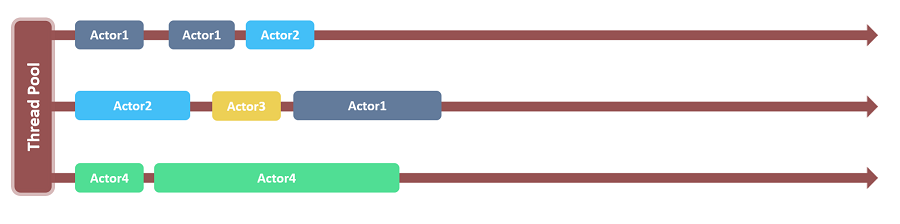

# Dispatchers
An Akka `MessageDispatcher` is what makes Akka Actors "tick", it is the engine of the machine so to speak. All `MessageDispatcher` implementations are also an `ExecutionContext`, which means that they can be used to execute arbitrary code, for instance `Futures`.

## Default dispatcher
Every `ActorSystem` will have a default dispatcher that will be used in case nothing else is configured for an Actor. The default dispatcher can be configured using `akka.actor.default-dispatcher`, and is by default a `Dispatcher`.

#### Actors multiplexing on .NET thread pool


## Looking up a Dispatcher
Dispatchers implement the ExecutionContext interface and can thus be used to run Future invocations etc.

```csharp
// this is scala.concurrent.ExecutionContext
// for use with Futures, Scheduler, etc.
ExecutionContext ex = system.Dispatchers.Lookup("my-dispatcher");
```
## Setting the dispatcher for an Actor
So in case you want to give your Actor a different dispatcher than the default, you need to do two things, of which the first is is to configure the dispatcher:

```json
my-dispatcher {
  # Dispatcher is the name of the event-based dispatcher
  type = Dispatcher
  # What kind of ExecutionService to use
  executor = "fork-join-executor"
  # Configuration for the fork join pool
  fork-join-executor {
    # Min number of threads to cap factor-based parallelism number to
    parallelism-min = 2
    # Parallelism (threads) ... ceil(available processors * factor)
    parallelism-factor = 2.0
    # Max number of threads to cap factor-based parallelism number to
    parallelism-max = 10
  }
  # Throughput defines the maximum number of messages to be
  # processed per actor before the thread jumps to the next actor.
  # Set to 1 for as fair as possible.
  throughput = 100
}
```

And here's another example that uses the `"thread-pool-executor"`:

```json
my-thread-pool-dispatcher {
  # Dispatcher is the name of the event-based dispatcher
  type = Dispatcher
  # What kind of ExecutionService to use
  executor = "thread-pool-executor"
  # Configuration for the thread pool
  thread-pool-executor {
    # minimum number of threads to cap factor-based core number to
    core-pool-size-min = 2
    # No of core threads ... ceil(available processors * factor)
    core-pool-size-factor = 2.0
    # maximum number of threads to cap factor-based number to
    core-pool-size-max = 10
  }
  # Throughput defines the maximum number of messages to be
  # processed per actor before the thread jumps to the next actor.
  # Set to 1 for as fair as possible.
  throughput = 100
}
```
For more options, see the `default-dispatcher` section of the Configuration.

Then you create the actor as usual and define the dispatcher in the deployment configuration.

```csharp
ActorRef myActor =
  system.ActorOf(Props.Create(typeof(MyUntypedActor)),
    "myactor");
```

```json
akka.actor.deployment {
  /myactor {
    dispatcher = my-dispatcher
  }
}
```

An alternative to the deployment configuration is to define the dispatcher in code. If you define the dispatcher in the deployment configuration then this value will be used instead of programmatically provided parameter.

```csharp
ActorRef myActor =
  system.ActorOf(Props.Create(typeof(MyUntypedActor)).WithDispatcher("my-dispatcher"),
    "myactor3");
```

>**Note**<br/>
>The dispatcher you specify in `WithDispatcher` and the dispatcher property in the deployment configuration is in fact a path into your configuration. So in this example it's a top-level section, but you could for instance put it as a sub-section, where you'd use periods to denote sub-sections, like this: "foo.bar.my-dispatcher"

## Types of dispatchers
There are 4 different types of message dispatchers:

* Dispatcher
  * This is an event-based dispatcher that binds a set of Actors to a thread pool. It is the default dispatcher used if one is not specified.
  * Sharability: Unlimited
  * Mailboxes: Any, creates one per Actor
  * Use cases: Default dispatcher, Bulkheading

* PinnedDispatcher
  * This dispatcher dedicates a unique thread for each actor using it; i.e. each actor will have its own thread pool with only one thread in the pool.
  * Sharability: None
  * Mailboxes: Any, creates one per Actor
  * Use cases: Bulkheading

* CallingThreadDispatcher
  * This dispatcher runs invocations on the current thread only. This dispatcher does not create any new threads, but it can be used from different threads concurrently for the same actor. See CallingThreadDispatcher for details and restrictions.
  * Sharability: Unlimited
  * Mailboxes: Any, creates one per Actor per Thread (on demand)
  * Use cases: Testing
  * Driven by: The calling thread (duh)

### More dispatcher configuration examples
Configuring a `PinnedDispatcher`:

```json
my-pinned-dispatcher {
  type = PinnedDispatcher
}
```

And then using it:

```csharp
ActorRef myActor = system.ActorOf(Props.Create(typeof(MyUntypedActor));
    .WithDispatcher("my-pinned-dispatcher"));
```
Note that `thread-pool-executor` configuration as per the above `my-thread-pool-dispatcher` example is NOT applicable. This is because every actor will have its own thread pool when using `PinnedDispatcher`, and that pool will have only one thread.

Note that it's not guaranteed that the same thread is used over time, since the core pool timeout is used for `PinnedDispatcher` to keep resource usage down in case of idle actors. To use the same thread all the time you need to add `thread-pool-executor.allow-core-timeout=off` to the configuration of the `PinnedDispatcher`.