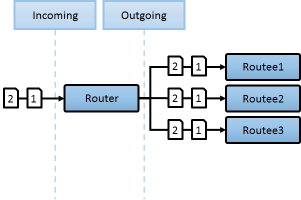
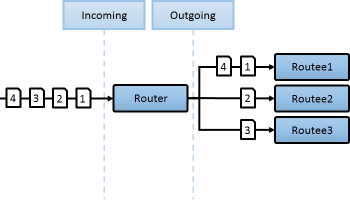

## TL;DR RoundRobin Group router example

```csharp
var system = ActorSystem.Create("MySystem");

//create workers
system.ActorOf<Worker>("Worker1");
system.ActorOf<Worker>("Worker2");
system.ActorOf<Worker>("Worker3");
system.ActorOf<Worker>("Worker4");

//create the router using round robin strategy
var router = system.ActorOf(Props.Empty.WithRouter(new RoundRobinGroup(
"user/Worker1", "user/Worker2", "user/Worker3", "user/Worker4")));

//pass messages via the router to the routees
for (int i = 0; i < 20; i++)
{
   router.Tell(i);
}
```
# Routers
Messages can be sent via a router to efficiently route them to destination actors, known as its routees. A Router can be used inside or outside of an actor, and you can manage the routees yourselves or use a self contained router actor with configuration capabilities.

Different routing strategies can be used, according to your application's needs. Akka comes with several useful routing strategies right out of the box. But, as you will see in this chapter, it is also possible to create your own.

> **Note:**<br/>
> In general, any message sent to a router will be sent onwards to its routees, but there is one exception.<br/>
> The special `Broadcast` Messages will send to all of a router's routees

## Routing strategies

### Broadcast
The broadcast router will as the name implies, broadcast any message to all of its routees.



### RoundRobin
A Router that uses round-robin to select a connection. For concurrent calls, round robin is just a best effort. 



RoundRobinPool defined in configuration:

```hocon
akka.actor.deployment {
  /parent/router1 {
    router = round-robin-pool
    nr-of-instances = 5
  }
}
```

```csharp
var router1 = context
     .ActorOf(new FromConfig().Props(Props.Create<Worker>()), "router1");
```

RoundRobinPool defined in code:

```csharp
var router2 = context
     .ActorOf(new RoundRobinPool(5).Props(Props.Create<Worker>()), "router2");
```

RoundRobinGroup defined in configuration:

```hocon
akka.actor.deployment {
  /parent/router3 {
    router = round-robin-group
    routees.paths = ["/user/workers/w1", "/user/workers/w2", "/user/workers/w3"]
  }
}
```


```csharp
var router3 = context.ActorOf(new FromConfig().Props(), "router3");
```

### ConsistentHash
A Router that uses consistent hashing to select a connection based on the sent message.

There is 3 ways to define what data to use for the consistent hash key.

1. You can define hashMapping / `WithHashMapper` of the router to map incoming messages to their consistent hash key. This makes the decision transparent for the sender.
2. The messages may implement `Akka.Routing.ConsistentHashingRouter.ConsistentHashable`. The key is part of the message and it's convenient to define it together with the message definition.
3. The messages can be be wrapped in a `Akka.Routing.ConsistentHashingRouter.ConsistentHashableEnvelope` to define what data to use for the consistent hash key. The sender knows the key to use.

These ways to define the consistent hash key can be use together and at the same time for one router. The hashMapping is tried first.


#### Usecase
`ConsistentHash` can be very useful when dealing with **"Commands"** in the sense of **CQRS** or **Domain Driven Design**.
For example, let's assume we have the following incoming sequence of **"Customer Commands"**:


In this case we might want to group all messages based on **"Customer ID"** (ID in the diagram).
By using a `ConsistentHash` router we can now process multiple commands in parallel for different Customers, while still processing messages for each specific Customer in ordered sequence, and thus preventing us from getting race conditions with ourselves when applying each command on each customer entity.


### ScatterGatherFirstCompleted
Simple router that broadcasts the message to all routees, and replies with the first response. 
You have to defin the 'within: Duration' parameter (f.e: within = 10 seconds). 


### Random
A Router that randomly selects one of the target connections to send a message to.

[No image yet]

### SmallestMailbox
A Router that tries to send to the non-suspended routee with fewest messages in mailbox. The selection is done in this order:

* Pick any idle routee (not processing message) with empty mailbox
* Pick any routee with empty mailbox
* Pick routee with fewest pending messages in mailbox
* Pick any remote routee, remote actors are consider lowest priority, since their mailbox size is unknown


## Pools vs. Groups
### Pools
Router "Pools" are routers that create their own worker actors, that is; you provide a `nrOfInstances` to the router and the router will handle routee creation by itself.

### Groups
Sometimes, rather than having the router actor create its routees, it is desirable to create routees separately and provide them to the router for its use. You can do this by passing an paths of the routees to the router's configuration. Messages will be sent with `ActorSelection` to these paths.

## How Routing is Designed within Akka.NET
On the surface routers look like normal actors, but they are actually implemented differently. Routers are designed to be extremely efficient at receiving messages and passing them quickly on to routees.

A normal actor can be used for routing messages, but an actor's single-threaded processing can become a bottleneck. Routers can achieve much higher throughput with an optimization to the usual message-processing pipeline that allows concurrent routing. This is achieved by embedding routers' routing logic directly in their ActorRef rather than in the router actor. Messages sent to a router's ActorRef can be immediately routed to the routee, bypassing the single-threaded router actor entirely.

The cost to this is, of course, that the internals of routing code are more complicated than if routers were implemented with normal actors. Fortunately all of this complexity is invisible to consumers of the routing API. However, it is something to be aware of when implementing your own routers.

## Supervision
Routees that are created by a pool router will be created as the router's children. The router is therefore also the children's supervisor.

The supervision strategy of the router actor can be configured with the supervisorStrategy property of the Pool. If no configuration is provided, routers default to a strategy of “always escalate”. This means that errors are passed up to the router's supervisor for handling. The router's supervisor will decide what to do about any errors.

Note the router's supervisor will treat the error as an error with the router itself. Therefore a directive to stop or restart will cause the router itself to stop or restart. The router, in turn, will cause its children to stop and restart.

It should be mentioned that the router's restart behavior has been overridden so that a restart, while still re-creating the children, will still preserve the same number of actors in the pool.

This means that if you have not specified supervisorStrategy of the router or its parent a failure in a routee will escalate to the parent of the router, which will by default restart the router, which will restart all routees (it uses Escalate and does not stop routees during restart). The reason is to make the default behave such that adding withRouter to a child’s definition does not change the supervision strategy applied to the child. This might be an inefficiency that you can avoid by specifying the strategy when defining the router.
