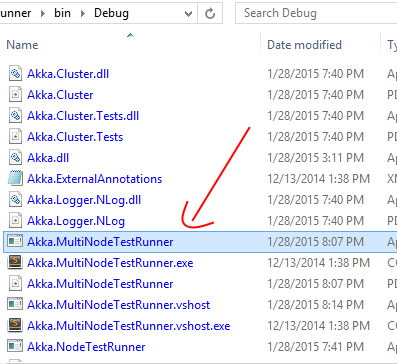

# Using Akka.NET MultiNode TestRunner

One of the most important sets of tests for `Akka.Remote` and `Akka.Cluster` are the `MultiNodeSpec`s - these are specs that test how distributed Akka.NET clusters behave across a variety of network scenarios.

But more importantly, you can use the `Akka.Remote.TestKit` (which contains the framework for writing a `MultiNodeSpec`) and the `Akka.MultiNodeTestRunner` for your own distributed tests!

This README explains how to run the `Akka.MultiNodeTestRunner` to execute any `MultiNodeSpec` instances found in a given .NET assembly.

## Running the MultiNodeTestRunner

Right now the only options for running the `MultiNodeTestRunner` is to build from the Akka.NET source and manually copy the binaries out of `src\core\Akka.MultiNodeTestRunner\bin\[Debug|Release]\[Platform name]`, where `[Platform name]` can be either `net5.0`, `net471`, or `netcoreapp3.1`:



## Commandline Arguments

```
C:> Akka.MultiNodeTestRunner.exe [assembly name] 
    [-Dmultinode.output-directory={dir-path}] 
    [-Dmultinode.failed-specs-directory={folder-name}] 
    [-Dmultinode.loglevel={DEBUG|INFO|WARNING|ERROR}] 
    [-Dmultinode.listen-address={ip-address}] 
    [-Dmultinode.listen-port={ip-port}] 
    [-Dmultinode.reporter={trx|teamcity|console}] 
    [-Dmultinode.clear-output={0|1}] 
    [-Dmultinode.spec={spec-filter}] 
    [-Dmultinode.include={include-filter}] 
    [-Dmultinode.exclude={exclude-filter}] 
```

- __assembly name__ : The full path or name of the assembly containing `MultiNodeSpec` tests.
- __-Dmultinode.output-directory__ : Folder where the test report will be exported. Default value is the current working directory.
- __-Dmultinode.failed-specs-directory__ : Folder name inside the output directory where failed test log will be exported, if a test should fail. Default value is `FAILED_SPECS_LOG`.
- __-Dmultinode.loglevel__ : Sets the minimum reported log level used within the test. Valid values are `DEBUG`, `INFO`, `WARNING`, and `ERROR`. Default value is `WARNING`.
- __-Dmultinode.listen-address__ : The TCP/IP address the multi node test runner should listen for test node reports/logs. Default value is `127.0.0.1`.
- __-Dmultinode.listen-port__ : The TCP/IP port the multi node test runner should listen for test node reports/logs. Default value is `6577`.
- __-Dmultinode.reporter__ : The report type this runner should export in. Valid values are `trx`, `teamcity`, and `console`. Note that report files are exported to the current directory for `trx`. Default value is `console`.
- __-Dmultinode.clear-output__ : This flag will clear the output folder before any test is run when it is set to 1. Default value is 0.
- __-Dmultinode.spec__ : Apply a filter to the test class names within the dll. Any fully qualified test class name that contains this string will run. Default value is (all).
- __-Dmultinode.include__ : A "`,`" (comma) separted list of wildcard pattern to be matched and included in the tests. Default value is `*` (all). The filter is applied on the name of the test method.
- __-Dmultinode.exclude__ : A "`,`" (comma) separted list of wildcard pattern to be matched and excluded in the tests. Default value is (none). The filter is applied on the name of the test method.

## Deprecated Commandline Arguments
- __-Dmultinode.teamcity__ : This argument is no longer processed. Use __-Dmultinode.reporter__ with `teamcity` value instead.

### Built-in Tests for Akka.Cluster

`Akka.Cluster.Tests` is already linked as a dependency by the `Akka.MultiNodeTestRunner`, so to run all of the `MultiNodeSpec` tests for `Akka.Cluster` you only need to do the following:

    C:> Akka.MultiNodeTestRunner.exe "Akka.Cluster.Tests.dll"

### Notes

If your test assembly has any dependent DLLs, make sure all of those assemblies can be found in the current working directory of the test runner. Otherwise you might get `Could not load file or assembly` exceptions at run time.

## Sample Output

*Working on cleaning this up now*


