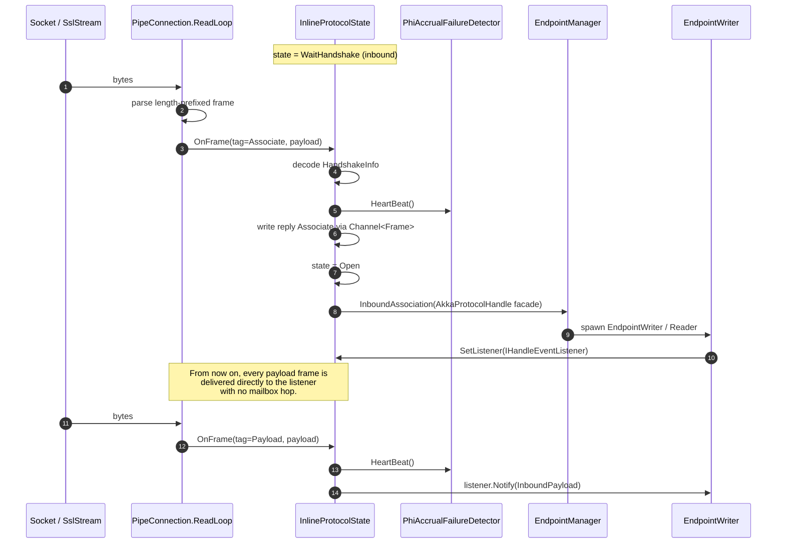

# Akka.Remote AkkaProtocol Redux (Phase 2)

> Companion to [akka-remote-transport-redux.md](./akka-remote-transport-redux.md).
> That doc covers Phase 1 — replacing the DotNetty wire transport with a
> `System.IO.Pipelines`-based implementation while leaving the
> `AkkaProtocolTransport` / `ProtocolStateActor` layer untouched. **This** doc
> covers Phase 2 — collapsing that FSM-actor layer into the new transport.

---

## What `AkkaProtocolTransport` Does Today

`AkkaProtocolTransport` is a logical `Transport` that wraps the physical
DotNetty `Transport` and adds three things on top of every association:

1. **A handshake** carrying a `HandshakeInfo { Origin: Address, Uid: int }`
   so that both sides learn each other's logical address and incarnation UID
   before any user payload flows.
2. **Heartbeats and a Phi-Accrual failure detector** so a silent peer is
   torn down even if the underlying socket is still nominally open.
3. **Disassociation semantics with a reason** (`Unknown`, `Shutdown`,
   `Quarantined`) wired to quarantine and `RefuseUid` handling in
   `EndpointManager`.

It implements all of this with a per-association FSM actor.

### The actor cast

| Type | Role |
|---|---|
| `AkkaProtocolTransport` | `ActorTransportAdapter` facade. `Associate(remote, refuseUid)` sends an `AssociateUnderlyingRefuseUid` to the manager. |
| `AkkaProtocolManager` | `ActorTransportAdapterManager`. On `InboundAssociation` or `AssociateUnderlying[RefuseUid]` it spawns one `ProtocolStateActor` per association, supervised `Directive.Stop`. |
| `ProtocolStateActor` | `FSM<AssociationState, ProtocolStateData>` — the actual protocol state machine. One per association. |
| `AkkaProtocolHandle` | `AbstractTransportAdapterHandle` returned to `EndpointWriter` / `EndpointReader`. `Write(payload)` calls `Codec.ConstructPayload` and forwards to the wrapped handle. `Disassociate(info)` is just `StateActor.Tell(new DisassociateUnderlying(info))`. |
| `AkkaPduCodec` (impl `AkkaPduProtobuffCodec`) | Protobuf encode/decode of `AkkaProtocolMessage` (control vs. payload) and `AckAndEnvelopeContainer` (seq/ack envelope). |

### The FSM

States are `AssociationState.Closed`, `WaitHandshake`, `Open`. Per-state data
classes (`OutboundUnassociated`, `OutboundUnderlyingAssociated`,
`InboundUnassociated`, `AssociatedWaitHandler`, `ListenerReady`) carry the
wrapped handle, the `TaskCompletionSource<AssociationHandle>` for the
caller, and a buffer queue for payloads that arrive before the upper-layer
listener has been wired in.

Outbound flow:

1. `Closed` + `HandleMsg` → call `SendAssociate`, start heartbeat timer,
   transition to `WaitHandshake`.
2. `WaitHandshake` + inbound `Associate` PDU → check `_refuseUid`; if it
   matches, `SendDisassociate(Quarantined)` and `Stop(ForbiddenUidReason)`;
   otherwise `_failureDetector.HeartBeat()`, cancel `HandshakeTimer`,
   transition to `Open` with an `AssociatedWaitHandler` that holds a
   queue plus a `Task<IHandleEventListener>` for the upper layer's
   read handler.

Inbound flow:

1. Starts in `WaitHandshake` with `InboundUnassociated`.
2. On the first inbound `Associate` PDU → `SendAssociate` (implicit ACK),
   start heartbeat timer, transition to `Open` and notify the
   `IAssociationEventListener` with a fresh `AkkaProtocolHandle`.

Common to both:

- `HeartbeatTimer` fires every `TransportHeartBeatInterval`. If the
  failure detector still says `IsAvailable`, send a `Heartbeat` PDU.
  Otherwise `SendDisassociate(Unknown)` and `Stop` with a
  `TimeoutReason`.
- `HandshakeTimer` fires once after `HandshakeTimeout`; if we are not
  yet in `Open`, send disassociate and stop.
- `Disassociated` from below → `Stop(Failure(d.Info))`.
- `OnTermination` fans the failure out to the
  `TaskCompletionSource<AssociationHandle>` (if outbound and not yet
  resolved), to the upper-layer listener via `Disassociated`, and
  finally to `WrappedHandle.Disassociate(reason, log)`.

### The two-phase listener registration

The `EndpointWriter` / `EndpointReader` cannot consume frames until they
are constructed, but the FSM may already be receiving payloads while it
waits. `ProtocolStateActor` solves this with a
`TaskCompletionSource<IHandleEventListener>` (`AkkaProtocolHandle.ReadHandlerSource`)
plus an internal `HandleListenerRegistered` message:

1. Promote to `Open` carrying an `AssociatedWaitHandler` whose `Queue`
   buffers `Payload` PDUs.
2. Upper layer eventually completes `ReadHandlerSource`; that
   continuation pipes a `HandleListenerRegistered` back into the FSM.
3. FSM drains the queue into the listener and transitions data state to
   `ListenerReady`.

### Wire format

`AkkaPduProtobuffCodec` produces three shapes wrapped in
`AkkaProtocolMessage` (a oneof of `Instruction` vs. `Payload`):

- `AkkaControlMessage { CommandType: Associate, HandshakeInfo }`
- `AkkaControlMessage { CommandType: Disassociate | DisassociateShuttingDown | DisassociateQuarantined }`
- `AkkaControlMessage { CommandType: Heartbeat }` — cached as a single
  static `ByteString` (`HeartbeatPdu`).
- A non-empty `Payload` field whose bytes are themselves an
  `AckAndEnvelopeContainer` (built by `EndpointWriter` via
  `ConstructMessage` / `ConstructPureAck`).

---

## Sources of Overhead

| # | Cost | Where it shows up |
|---|---|---|
| 1 | **One actor per association**, one mailbox hop per inbound frame and one per outbound frame | `ProtocolStateActor` receives every `InboundPayload`, decodes the PDU, then calls `Listener.Notify`. Outbound `Disassociate` and `Heartbeat` are also Tells. |
| 2 | **FSM allocations** on every event | `Event<T>`, `State<S,D>`, `FSMBase.Reason`, plus rebuilt data records. `Open + Payload` allocates a fresh `Queue<ByteString>` every frame while waiting for the listener (`new Queue<ByteString>(awh.Queue)`). |
| 3 | **Two-phase listener handshake** | `ReadHandlerSource` is a `TaskCompletionSource`, `ListenForListenerRegistration` adds a `ContinueWith` + `PipeTo(Self)`, the FSM then walks the queue. Adds at least one scheduler hop per association. |
| 4 | **Scheduler-driven heartbeats** | `SetTimer("heartbeat-timer", new HeartbeatTimer(), interval, repeat: true)` per association. With N associations that is N independent scheduler entries and N mailbox enqueues per tick. |
| 5 | **Failure detector behind an actor** | `_failureDetector.HeartBeat()` and `IsAvailable` are called from message handlers, so every signal pays the mailbox cost above. |
| 6 | **Codec is interface-dispatched and reflective** | `_codec.DecodePdu(...)` returns `IAkkaPdu`, then a `switch` dispatches; the underlying `AkkaProtocolMessage.Parser.ParseFrom` is protobuf-reflective and allocates regardless of whether the frame is a 0-byte heartbeat or a 64 KB payload. |
| 7 | **Disassociate path Tells** | `AkkaProtocolHandle.Disassociate(info)` is `StateActor.Tell(new DisassociateUnderlying(info))` — even a graceful shutdown costs another mailbox round-trip. |

---

## Stack: Today vs. Phase 2

```mermaid
graph TD
    subgraph Today["Phase 1 — FSM actor per association"]
        EM1[EndpointManager] --> EW1[EndpointWriter / Reader]
        EW1 --> APH1[AkkaProtocolHandle]
        APH1 --> PSA[ProtocolStateActor &#40;FSM&#41;]
        PSA --> Codec1[AkkaPduProtobuffCodec]
        PSA --> FD1[PhiAccrualFailureDetector]
        PSA --> Sched1[ActorSystem Scheduler<br/>HeartbeatTimer / HandshakeTimer]
        PSA --> WH1[Wrapped AssociationHandle]
        WH1 --> Pipe1[PipeConnection read/write loops]
    end

    subgraph Phase2["Phase 2 — inline state machine on the read loop"]
        EM2[EndpointManager] --> EW2[EndpointWriter / Reader]
        EW2 --> APH2[AkkaProtocolHandle &#40;facade&#41;]
        APH2 --> Conn[PipeConnection]
        Conn --> SM[InlineProtocolState<br/>&#40;struct + enum switch&#41;]
        Conn --> Codec2[AkkaPduProtobuffCodec<br/>or MessagePack]
        SM --> FD2[PhiAccrualFailureDetector<br/>&#40;called from read loop&#41;]
        SM --> Tick[Shared PeriodicTimer<br/>per transport]
    end
```



Net effect: the `ProtocolStateActor` box and its mailbox disappear; the
state machine runs as a plain method called from inside the connection's
`PipeReader` loop. `AkkaProtocolHandle` survives as a thin facade so the
upper layers see the same `AssociationHandle` SPI.

---

## Inline Handshake (no FSM actor)



Key differences vs. today:

- The FSM lives on the read loop; there is **no `Tell`** between
  decoding a frame and notifying the listener.
- The `AkkaProtocolHandle` facade is created and surfaced to
  `EndpointManager` only **after** the handshake completes, so
  `EndpointWriter` never sees a half-open association and the
  `AssociatedWaitHandler` queue / `HandleListenerRegistered` dance is
  gone.
- A handful of frames that arrive in the (sub-microsecond) window
  between `Open` and `SetListener` are buffered in a tiny
  `ArrayBuffer<ReadOnlySequence<byte>>` on the connection rather than
  allocated as fresh `Queue<ByteString>` instances per frame.

---

## Frame-Tag Fast Path

Today every inbound frame is parsed as `AkkaProtocolMessage` before we
know whether it is control or payload. Phase 2 prefixes each frame with
a single byte tag that mirrors the existing `CommandType` plus
`Payload`:

```
+--------+--------+----+----+----+----+========================+
| len32 (BE)      | tg | <body bytes>                          |
+--------+--------+----+----+----+----+========================+

tg = 1 Associate    body = AkkaHandshakeInfo (protobuf or msgpack)
tg = 2 Disassociate body = 1 byte DisassociateInfo enum
tg = 3 Heartbeat    body = empty
tg = 4 Payload      body = AckAndEnvelopeContainer bytes
```

Heartbeats are a fixed 5-byte frame and never enter the protobuf
parser. `Payload` frames are forwarded to the upper-layer listener as
the same `AckAndEnvelopeContainer` bytes today's code expects, so
`EndpointReader` is unchanged.

**Wire compatibility**: a `pipe.tcp` node configured with
`envelope = protobuf` and `inline-protocol = off` produces and consumes
the legacy `AkkaProtocolMessage`-wrapped bytes. The tagged frame layout
above only kicks in when both peers negotiate
`inline-protocol = on` (Phase 2). See the migration section.

---

## FSM Actor vs. Inline State Machine

| Concern | `ProtocolStateActor` (today) | Inline state machine (Phase 2) |
|---|---|---|
| Threading model | Akka mailbox + dispatcher | The connection's `PipeReader` `async` loop |
| Per-frame cost | Decode → `Tell` → mailbox dequeue → `Notify` | Decode → direct method call to `IHandleEventListener` |
| State representation | `FSM<AssociationState, ProtocolStateData>` + 5 data classes | `enum InlineState { WaitHandshake, Open, Closed }` + a `struct InlineProtocolState` field on the connection |
| State transition allocs | `Event<T>`, `State<S,D>`, new data record per change | Field assignment; zero allocation on the steady-state path |
| Heartbeat timer | One `SetTimer` per association on the system scheduler | One `PeriodicTimer` per transport, fans out to active connections |
| Handshake timer | `SetTimer(HandshakeTimerKey, …)` per association | `Stopwatch.GetTimestamp()` checked from the heartbeat tick |
| Failure detector | `_failureDetector.HeartBeat()` from message handler | Same call, made directly on the read loop after every frame |
| Listener wiring | `TaskCompletionSource<IHandleEventListener>` + `HandleListenerRegistered` | Single `Volatile.Write` to a `_listener` field, with a tiny pre-listener buffer |
| Outbound `Disassociate` | `StateActor.Tell(DisassociateUnderlying)` | Direct enqueue on the connection's `Channel<Frame>` |
| Quarantine / `RefuseUid` | Compared in `WaitHandshake` after decoding `Associate` | Same comparison, same `Disassociate(Quarantined)` reply, same `ForbiddenUidReason` raised to `EndpointManager` |
| Debuggability | Akka FSM event log, supervised under `AkkaProtocolManager` | Inline log statements + structured trace; FSM event log goes away |

---

## Thread-Safety: Outbound vs. Inbound

The inline state machine is touched from two sides:

- **Inbound (read loop):** decodes frames, advances state, calls
  `_failureDetector.HeartBeat()`, hands payloads to the listener.
- **Outbound (`AkkaProtocolHandle.Write` from `EndpointWriter`):** must
  check that the handshake is complete and enqueue a Payload frame.

Two viable designs:

1. **Funnel outbound through the same `Channel<Frame>` already used by
   the writer loop.** State checks happen inside the writer loop, which
   is single-threaded by construction. `EndpointWriter` only ever
   `TryWrite`s; the channel handles backpressure.
2. **Lock-free state load.** `InlineProtocolState.Phase` is an
   `int` field; outbound `Write` does an `Volatile.Read` and refuses if
   not `Open`. Frames still go through the writer channel but
   `Disassociate` can be enqueued from any thread.

Recommend **(1)** as the default — it preserves a single ownership rule
("the writer loop owns outbound state") and matches how
`Channel<Frame>` is already used in the Phase 1 transport.

---

## Failure Detector Without an Actor

`PhiAccrualFailureDetector` already has its own `Clock` abstraction and
holds its sample state in private fields. The only Akka coupling is
through `FailureDetectorRegistry.LoadFailureDetector(...)`, which calls
the `(Config, EventStream)` constructor.

Phase 2 keeps the same construction path inside `PipeTransport` setup
(`FailureDetectorRegistry` / `Context.LoadFailureDetector` equivalents
called once at transport startup), then invokes
`heartbeat()` / `IsAvailable` directly from the read loop and the
shared heartbeat tick — no behavioural change, just no mailbox between
the call sites and the detector.

---

## Surfacing Errors Without Re-introducing a Mailbox Hop

Hot-path frames (Payload, Heartbeat) bypass the `EndpointManager` entirely
and go straight to the existing `IHandleEventListener`. Errors and
lifecycle events still need to reach `EndpointManager`:

- **Disassociation (any reason)** — one-shot `IActorRef.Tell` of a
  `Disassociated(info)` to the listener actor, exactly as today.
- **Quarantine / `RefuseUid` failures during handshake** — the inline
  state machine fails the outbound
  `TaskCompletionSource<AssociationHandle>` with the same
  `AkkaProtocolException` text the FSM produces today (so log scraping
  and tests stay valid), then closes the connection.
- **Underlying transport errors** — published to the system event
  stream the same way `PublishError` does today.

The cost is at most one `Tell` per association lifetime, not per frame.

---

## Migration Strategy

Phase 2 is **opt-in** for at least one minor release.

- **HOCON switch**: `akka.remote.pipe.tcp.inline-protocol = off`
  default in the first release that ships it. When `off`, the new
  `PipeTransport` continues to wrap `AkkaProtocolTransport` exactly
  like Phase 1; the inline state machine is not constructed.
- When `on`, `PipeTransport` constructs the inline state machine
  directly and **does not register `AkkaProtocolTransport`** in the
  adapter chain. The `AkkaProtocolHandle` facade is created by the
  inline implementation so `EndpointManager`, `EndpointWriter`,
  `EndpointReader`, and `ReliableDeliverySupervisor` see no API change.
- **Wire compatibility** is preserved when the protobuf codec is
  selected and `inline-protocol = off`. With `inline-protocol = on`
  both peers must agree (it changes the framing tag); this is gated
  the same way the MessagePack envelope is gated in Phase 1.

### Behaviours that MUST be preserved exactly

- Quarantine: receiving `DisassociateQuarantined` from a remote with
  a known UID still triggers the same `AkkaProtocolException` text
  (`"The remote system has quarantined this system…"`) so
  `EndpointManager`'s quarantine bookkeeping is unchanged.
- `RefuseUid`: outbound association where the remote's `Associate.Uid`
  matches the supplied refuseUid still results in
  `SendDisassociate(Quarantined)` followed by an
  `AkkaProtocolException` carrying the `ForbiddenUidReason` text.
- Handshake timeout: `AkkaProtocolException` text and
  `TimeoutException` propagation to the
  `TaskCompletionSource<AssociationHandle>` are byte-for-byte identical.
- Disassociate-with-reason logging: the `DisassociationReason(reason)`
  strings emitted today by `ProtocolStateActor.OnTermination` must
  appear in the same log messages.

### Behaviour change that needs a release note

- The Akka FSM event log for `ProtocolStateActor` (visible if you
  enable `akka.actor.debug.fsm = on`) goes away when
  `inline-protocol = on`. There is no equivalent FSM trace; the inline
  implementation logs the same transitions at `Debug` instead.

### Test plan

- Re-run `AkkaProtocolSpec` and `AkkaProtocolStressTest` (under
  `src/core/Akka.Remote.Tests/Transport/`) twice in CI: once against
  the FSM implementation, once with `inline-protocol = on`. Both must
  pass unchanged.
- Re-run the existing remoting integration tests
  (`Akka.Remote.Tests` + `Akka.Cluster.Tests`) under both modes.
- Add a focused unit suite for the inline state machine that
  exercises every transition the FSM does today
  (`Closed → WaitHandshake`, `WaitHandshake → Open`,
  `Open → Closed` via `Disassociate(*)`, both handshake and heartbeat
  timeouts, refuseUid path).
- Wire-format snapshot test: capture every PDU bytes produced by
  `AkkaPduProtobuffCodec` today and assert the inline implementation
  produces the same bytes when `envelope = protobuf` and
  `inline-protocol = off`.

---

## Risks & Open Questions

1. **Handshake-state visibility on outbound writes.** Recommend
   funnelling all outbound frames through the per-connection
   `Channel<Frame>`; do we need a non-blocking "try, else drop"
   variant for `Heartbeat` to avoid HOL-blocking under user-payload
   pressure?
2. **Pre-listener buffering bound.** Today's `AssociatedWaitHandler.Queue`
   is unbounded (`Queue<ByteString>`). The inline implementation should
   bound it (e.g. 32 frames) and trip a hard disassociation if exceeded —
   strictly safer, but a behaviour change worth flagging in the release
   note.
3. **`PhiAccrualFailureDetector` clock source.** Currently uses Akka's
   `Clock` abstraction. Inline use from the read loop means we should
   verify the default `Clock` implementation is lock-free; if it is
   not, swap to a `Stopwatch.GetTimestamp()`-backed clock at
   construction.
4. **Removing `AkkaProtocolTransport` registration when
   `inline-protocol = on`.** The current `Remoting` startup wraps every
   loaded transport with `AkkaProtocolTransport` automatically. Phase 2
   needs a clean way for `PipeTransport` to opt out of that wrap
   without breaking the loader contract for other transports.
5. **Diagnostics.** Some operators rely on the FSM event log to debug
   association problems. We should ship a structured replacement
   (e.g. `Akka.Remote.InlineProtocol.Trace` event source) before
   defaulting `inline-protocol` to `on`.

---

## Out of Scope

- Replacing `EndpointWriter` / `ReliableDeliverySupervisor` (Artery-style
  outbound stream) — separate proposal.
- Changing the wire envelope (`AckAndEnvelopeContainer`) — covered by
  the Phase 1 doc's MessagePack discussion.
- Removing `AkkaProtocolTransport` for transports other than the new
  `PipeTransport`. The DotNetty transport keeps the FSM until it is
  retired.

