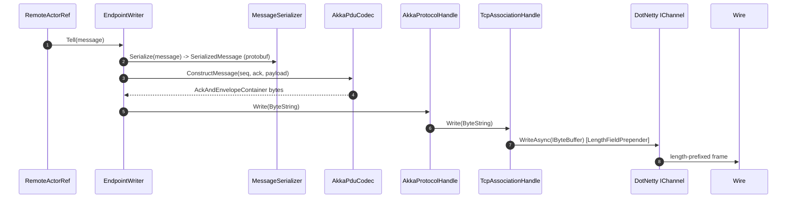

# Akka.Remote.Transport Redux

We want to replace the current DotNetty transport with a new one.

we want to consider both TCP and TLS.
We want to be able to compare performance between the old and new transports.

We should consider modern Dotnet designs using System.IO.Pipelines such as exampled by [Nats.Net v2](https://github.com/nats-io/nats.net)
and [Akka.Streams](https://github.com/akkadotnet/akka.net/tree/dev/src/Akka.Streams).

We should also consider the possibility of this new transport using MessagePack rather than Protobuf for envelopes.

---

## Current Architecture

Akka.Remote today is a layered stack of actors sitting on top of an abstract
`Transport` SPI, with the only production implementation being the DotNetty
TCP/TLS transport.

```mermaid
graph TD
    subgraph User["User Code"]
        URef[RemoteActorRef.Tell]
    end

    subgraph Provider["Provider Layer"]
        RARP[RemoteActorRefProvider]
        RT[Remoting]
    end

    subgraph EndpointActors["Endpoint Actor Layer (per remote address)"]
        EM[EndpointManager]
        RDS[ReliableDeliverySupervisor]
        EW[EndpointWriter]
        ER[EndpointReader]
    end

    subgraph Protocol["Akka Protocol Layer (FSM per association)"]
        APM[AkkaProtocolManager]
        PSA[ProtocolStateActor &#40;FSM&#41;]
        APH[AkkaProtocolHandle]
        Codec[AkkaPduCodec &#40;protobuf&#41;]
    end

    subgraph TransportSPI["Transport SPI"]
        T[Transport &#40;abstract&#41;<br/>Listen / Associate]
        AH[AssociationHandle]
        HEL[IHandleEventListener]
        AEL[IAssociationEventListener]
    end

    subgraph DotNetty["DotNetty Implementation"]
        DNT[DotNettyTransport]
        TCP[TcpTransport]
        TH[TcpServerHandler / TcpClientHandler]
        TAH[TcpAssociationHandle]
        BW[BatchWriter]
        SSL[DotNettySslSetup &#40;TlsHandler&#41;]
    end

    Sock[(Socket / Wire)]

    URef --> RARP --> RT --> EM
    EM --> RDS --> EW
    EM --> ER
    EW --> APH
    ER --> APH
    APH --> PSA
    PSA --> APM
    APH --> Codec
    APM --> T
    APH --> AH
    AH --> HEL
    T --> AEL
    T --> DNT
    DNT --> TCP
    TCP --> TH
    TH --> TAH
    TAH --> BW
    TCP -. optional .-> SSL
    BW --> Sock
    SSL --> Sock
```



### Outbound Message Flow



The inbound path is the mirror image: `TcpHandlers.ChannelRead` copies the
incoming `IByteBuffer` into a Google `ByteString`, raises `InboundPayload` on
the `IHandleEventListener`, the `ProtocolStateActor` decodes it via
`AkkaPduCodec`, and an `AckAndMessage` is forwarded to the `EndpointReader`,
which dispatches to the local `IInternalActorRef`.

### Pain Points Motivating a Rewrite

- **DotNetty is effectively unmaintained** and increasingly painful on modern
  .NET (TFM churn, trimming/AOT hostility, allocation-heavy buffers).
- **Per-read allocations** &mdash; `TcpHandlers.ChannelRead` calls
  `ByteString.CopyFrom` for every inbound frame, defeating any pooling Netty
  does upstream.
- **Protobuf reflection** in the hot path for `AckAndEnvelopeContainer` adds
  CPU + GC pressure that source-generated codecs avoid.
- **Actor-per-association FSM overhead** &mdash; `ProtocolStateActor` adds a
  mailbox hop on every inbound and outbound frame.
- **No `System.IO.Pipelines` backpressure** &mdash; flow control today is
  emulated via `BatchWriter` + DotNetty water-marks rather than the BCL's
  pipe primitives.
- **TLS via DotNetty `TlsHandler`** instead of the BCL `SslStream`, which
  diverges from the rest of the .NET ecosystem.

---

## Proposed Architecture

The new transport drops in at the existing `Transport` SPI, so Phase 1 leaves
every actor above it (`EndpointManager`, `EndpointWriter`/`Reader`,
`AkkaProtocolHandle`, `ProtocolStateActor`) untouched. This keeps quarantine,
handshake, and reliable-delivery semantics identical and lets us A/B the wire
implementation only.

```mermaid
graph TD
    subgraph Unchanged["Unchanged Upper Layers"]
        EM[EndpointManager]
        EW[EndpointWriter / EndpointReader]
        APH[AkkaProtocolHandle / ProtocolStateActor]
    end

    subgraph NewTransport["New PipeTransport &#40;Transport SPI&#41;"]
        PT[PipeTransport]
        Listener[Socket Accept Loop]
        Conn[PipeConnection &#40;per association&#41;]
        Reader[Read Loop<br/>PipeReader + SequenceReader]
        Writer[Write Loop<br/>Channel&lt;Frame&gt; + PipeWriter]
        PAH[PipeAssociationHandle]
        Frame[FrameCodec &#40;length-prefixed&#41;]
    end

    subgraph Codec["Pluggable Envelope Codec"]
        PB[Protobuf AkkaPduCodec<br/>&#40;wire-compat default&#41;]
        MP[MessagePack Codec<br/>&#40;opt-in&#41;]
    end

    subgraph BCL[".NET BCL"]
        Sock[(Socket)]
        Ssl[SslStream &#40;TLS&#41;]
        Pipe[System.IO.Pipelines]
    end

    EM --> EW --> APH --> PT
    PT --> Listener --> Conn
    PT --> Conn
    Conn --> Reader
    Conn --> Writer
    Reader --> Frame --> PAH --> APH
    APH --> PAH --> Writer
    Writer --> Frame
    Frame --> PB
    Frame -. opt-in .-> MP
    Reader --> Pipe
    Writer --> Pipe
    Pipe --> Sock
    Pipe -. TLS .-> Ssl --> Sock
```



### Key Design Choices

- **`SocketConnection` + `PipeReader`/`PipeWriter`** modeled on Nats.Net v2's
  `NatsConnection` / `CommandWriter` and Akka.Streams' `TcpStage`. Reads parse
  frames directly off `ReadOnlySequence<byte>` &mdash; zero copy until the
  envelope codec needs a contiguous span.
- **Length-prefixed framing** identical to today's
  `LengthFieldBasedFrameDecoder` layout (4-byte BE length + payload), so a
  Pipelines node and a DotNetty node remain wire-compatible when both use the
  protobuf codec.
- **Write coalescing** via a bounded `Channel<Frame>` feeding a single writer
  loop that flushes the `PipeWriter` once per drained batch &mdash; same idea
  as `BatchWriter` but expressed in BCL primitives.
- **TLS via `SslStream`**, wrapped over the raw `Socket` before the pipe is
  built. Cert loading reuses the existing HOCON keys from `DotNettySslSetup`.
- **MessagePack envelope (opt-in)** &mdash; a `MessagePackPduCodec` mirrors
  the `AckAndMessage` shape (handshake, heartbeat, disassociate, payload with
  seq/ack) using source-generated formatters. Gated behind
  `akka.remote.pipe.tcp.envelope = messagepack` and only safe when the
  entire cluster is on the new codec.

### Phase 2 (Future)

Once Phase 1 is proven, collapse the `ProtocolStateActor` FSM into the
transport itself (handshake/heartbeat handled inline on the read loop) to
remove a mailbox hop per frame. This is explicitly **out of scope** for the
initial PR &mdash; see the companion doc
[akka-remote-akka-protocol-redux.md](./akka-remote-akka-protocol-redux.md)
for the detailed Phase 2 design.

---

## Comparison

| Concern             | Current (DotNetty)                              | Proposed (Pipelines)                              |
|---------------------|-------------------------------------------------|---------------------------------------------------|
| Dependency          | `DotNetty.*` (unmaintained)                     | BCL `System.IO.Pipelines` only                    |
| Buffers             | `IByteBuffer` &rarr; `ByteString.CopyFrom`      | Pooled `ReadOnlySequence<byte>`, zero-copy reads  |
| Async model         | Netty event-loop threads                        | `async`/`await` reader+writer loops per conn      |
| Framing             | `LengthFieldBasedFrameDecoder/Prepender`        | Hand-rolled `SequenceReader<byte>` (same layout)  |
| TLS                 | DotNetty `TlsHandler`                           | `SslStream` over `Socket`                         |
| Envelope (default)  | Protobuf reflection (`AckAndEnvelopeContainer`) | Same protobuf bytes (compat)                      |
| Envelope (opt-in)   | n/a                                             | Source-gen MessagePack                            |
| Write batching      | `BatchWriter` + Netty water-marks               | `Channel<Frame>` + `PipeWriter` flush coalescing  |
| SPI surface         | `Transport` / `AssociationHandle`               | **Unchanged** &mdash; same SPI, new impl          |

---

## Migration / Compatibility

- **Wire compatibility** is preserved when the MessagePack codec is **off**.
  The new transport produces and consumes the exact same length-prefixed
  `AkkaProtocolMessage` / `AckAndEnvelopeContainer` bytes as DotNetty, so a
  Pipelines node can join an otherwise-DotNetty cluster.
- **HOCON switch:** ship both transports in `Akka.Remote` and let users opt
  in via `akka.remote.enabled-transports = ["akka.remote.pipe.tcp"]`. Default
  stays on `dot-netty.tcp` for at least one minor release.
- **MessagePack envelope is cluster-wide opt-in** and breaks compat with
  older nodes &mdash; gated, documented, off by default.
- **TLS configuration keys are reused** (cert path, password, validation
  flags) so existing deployments only change the transport class name.
- **Quarantine, handshake, reliable delivery** are unchanged because we
  reuse `ProtocolStateActor` and `EndpointManager` verbatim in Phase 1.

---

## Benchmarking Plan

Goal: prove the new transport is &ge; DotNetty on every axis before flipping
the default.

- **Harnesses**
  - Reuse `src/benchmark/RemotePingPong` for end-to-end throughput.
  - Reuse `src/core/Akka.Remote.Tests.Performance` NBench specs as a smoke
    gate in CI.
  - Add a new BenchmarkDotNet project comparing the two transports head-to-head
    with `MemoryDiagnoser` enabled.
- **Matrix**
  - Concurrent associations: 1, 8, 64
  - Payload sizes: 64 B, 1 KB, 64 KB
  - TLS: off / on
  - Envelope: protobuf / MessagePack (new transport only)
- **Metrics**
  - Throughput (msgs/sec, MB/sec)
  - Latency p50 / p99 / p999
  - Allocations per message, Gen0/1/2 collections
  - CPU% at saturation
- **Backpressure spec**
  - New `RemoteSurgeBenchmark` with a deliberately slow consumer to validate
    `PipeWriter` backpressure vs DotNetty water-marks &mdash; assert no
    unbounded queue growth.
- **Baseline first:** capture DotNetty numbers on `dev` and check them in
  alongside the new benchmark project so regressions are obvious in PRs.

---

## Out of Scope (for now)

- UDP / Aeron-style transports
- Full Artery parity
- Cluster sharding / DData changes
- Removing `ProtocolStateActor` (deferred to Phase 2)

---

## Switching from DotNetty to the Pipelines Transport

### Minimal opt-in (plain TCP, port 2553)

```hocon
akka {
  remote {
    # Replace the DotNetty driver with the Pipelines driver.
    enabled-transports = ["akka.remote.pipe.tcp"]

    pipe.tcp {
      hostname = "127.0.0.1"   # or your public IP / hostname
      port     = 2553
    }
  }
}
```

> **Tip:** Set `port = 0` to let the OS pick a random available port —
> useful in tests and when running multiple nodes on one machine.

### Keeping DotNetty as a fallback during a rolling upgrade

Ship the new transport on new nodes while old nodes still use DotNetty.
Add **both** transports and let Akka.Remote negotiate the best match:

```hocon
akka.remote {
  # New nodes listen on both transports.
  # Old DotNetty-only nodes will still connect via dot-netty.tcp.
  enabled-transports = ["akka.remote.pipe.tcp", "akka.remote.dot-netty.tcp"]

  pipe.tcp {
    hostname = "0.0.0.0"
    port     = 2552           # same port — each transport binds a separate socket
  }

  dot-netty.tcp {
    hostname = "0.0.0.0"
    port     = 2553
  }
}
```

### With TLS

```hocon
akka.remote.pipe.tcp {
  hostname   = "0.0.0.0"
  port       = 2552
  enable-ssl = on

  ssl {
    certificate {
      path     = "/etc/akka/node.pfx"
      password = "secret"
    }
    suppress-validation          = off
    require-mutual-authentication = on
    validate-certificate-hostname = off
  }
}
```

Certificate loading supports both a file path (`.pfx` / `.p12`) and a
Windows certificate-store thumbprint — identical settings to the
`akka.remote.dot-netty.tcp.ssl` block so existing cert deployments
require no changes other than the transport-class path.

### Full reference for `akka.remote.pipe.tcp`

| Key | Default | Notes |
|---|---|---|
| `transport-class` | `Akka.Remote.Transport.Pipelines.TcpPipeTransport,Akka.Remote` | Loaded by reflection |
| `hostname` | `""` (→ `0.0.0.0`) | Bind address |
| `public-hostname` | same as `hostname` | Address advertised to peers |
| `port` | `2552` | Use `0` for random |
| `public-port` | `0` (→ same as `port`) | Advertised port (NAT / Docker) |
| `enable-ssl` | `false` | Enable TLS |
| `connection-timeout` | `15 s` | Outbound TCP connect timeout |
| `maximum-frame-size` | `128000b` | Max payload bytes (≥ 32 000) |
| `send-buffer-size` | `256000b` | `SO_SNDBUF` |
| `receive-buffer-size` | `256000b` | `SO_RCVBUF` |
| `backlog` | `4096` | `Socket.Listen` backlog |
| `tcp-keepalive` | `on` | OS-level keepalive probes |
| `tcp-nodelay` | `on` | Disable Nagle's algorithm |
| `dns-use-ipv6` | `false` | Prefer IPv6 in DNS resolution |
| `write-channel-capacity` | `1024` | Outbound write-channel bound |
| `envelope` | `protobuf` | PDU envelope codec: `"protobuf"` (wire-compat default) or `"messagepack"` (cluster-wide opt-in, better perf) |

### Enabling MessagePack envelopes (cluster-wide opt-in)

> ⚠️ **Every node in the cluster must use the same codec.** Mixed-codec clusters
> will throw `PduCodecException` on decode.  Roll out in a coordinated cluster
> restart, not a rolling upgrade.

```hocon
akka.remote.pipe.tcp {
  hostname = "0.0.0.0"
  port     = 2552
  envelope = messagepack   # switch from protobuf to MessagePack
}
```

The MessagePack codec (`AkkaPduMessagePackCodec`) mirrors the
`AkkaProtocolMessage` / `AckAndEnvelopeContainer` protobuf schema using the
[MessagePack-CSharp](https://github.com/MessagePack-CSharp/MessagePack-CSharp)
v3 library already bundled in `Akka.Remote`.  It produces smaller frames
and lower GC pressure because:

- Control messages (heartbeat, disassociate) are pre-serialised into static
  `byte[]` fields — **no per-call allocation**.
- Actor-ref paths are stored as plain strings (same data, no protobuf
  `ActorRefData` wrapper struct).
- `MpPayload` fields that are empty are serialised as MessagePack `nil` instead
  of an empty `bytes` field, saving a few bytes per message.

